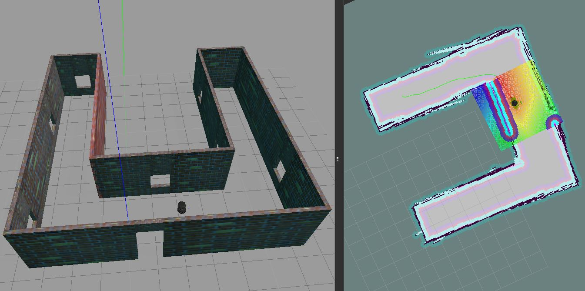

# Home Service Robot

*This repository presents my solution to the Udacity Home Service Robot Project. A SLAM algorithm is used to create a map of an environment. Then the map is used to localize a robot and plan its trajectory towards an object to pick-up and drop it off at another location. The entire project is created through ROS packages.*

## Objective

The project is built entirely with ROS packages (some existing and some newly created). The objective is to create a map of an environment through SLAM, and then localize and navigate through it in order to reach target locations.

The project is split in several parts:

* design a custom environment,
* make a *wall follower* node to navigate autonomously following walls,
* use a SLAM algorithm to map the environment,
* create a *pick objects* node to go to target object location followed by drop off location,
* create a *add markers* node to display objects on rviz,
* establish a communication between nodes to notify of reached locations.

The robot used for navigation is *turtlebot* present as a standard ROS package.

## Architecture

The project is made of several ROS packages:

* *turtlebot_gazebo* loads our custom world environment in gazebo and creates a turtlebot robot,
* *turtlebot_teleop* for manually operating the turtlebot,
* *gmapping* uses the camera, laser & odometry in order to simultaneously localize the robot and map the environment (SLAM algorithm),
* *wall_follower* controls the robot and make it continuously follow the left wall,
* *amcl* is a probabilistic localization system that uses a particle filter to track a robot through a given map,
* *pick_objects* sends target pick-up and drop-off locations, and notify when those have been reached,
* *rviz* is used for visualization of the environment, the robot, and any other parameter (laser scan, localization particles, navigation cost maps and path, etc),
* *add_markers* is used to visualize simulated objects at pick-up and drop-off locations on rviz.

## Installing

A script has been developed for quick installation:

* Copy the `setup.sh` script in your home directory.
* Ensure you don't have a **catkin_ws** directory as its contents may be deleted.
* Run `./setup.sh`

This will clone the full repository, including required ROS packages as submodules.

## Running the scripts

The entire project can be run through the scripts present in `src/ShellScripts`.

Each script contains a `$DIR` variable to be set to the catkin folder path.

The different scripts were developped in the following sequence:

* `test_slam.sh` - generate a map through SLAM while navigating manually
* `wall_follower.sh` - generate a map through SLAM while navigating autonomously following walls
* `test_navigation.sh` - load map generated through SLAM and define manually target navigation goals
* `pick_objects.sh` - run autonously the robot towards pick-up and drop-off locations
* `add_markers.sh` - add objects as markers to rviz
* `home_service.sh` - run autonomously the robot to pick up target object and bring it to drop off location, with rviz visualization

## Built With

* [SLAM Gmapping](https://github.com/ros-perception/slam_gmapping) - The SLAM algorithm
* [Turtlebot](https://github.com/turtlebot) - ROS robot model and its stack
